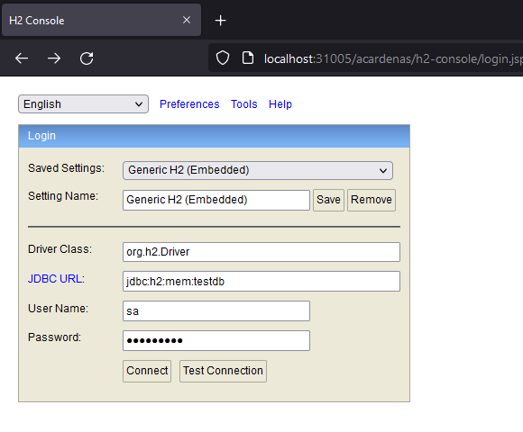

# API Equipo futbol

>El servicio tiene el `crud` completo de los jugadores y equipos. Además, al consultar el/los equipos devuelve
el acumulado de los goles de los jugadores.


### Introducción
El servicio está construido con `JAVA 11`, `Spring Boot`, Base de datos `H2`, `JPA` y `Docker`.

### Cómo iniciar con docker
En orden para iniciar el proyecto:
```bash
$git clone git@github.com:acardenasr6/api_equipo_futbol.git

# compilación del proyecto
$ mvn clean install 

# iniciar el proyecto
$ docker-compose up -d
```
#### 

### Accedo a la base de datos H2
- Url -> `http://localhost:31005/acardenas/h2-console/`
- JDBC_URL: `jdbc:h2:mem:testdb` 
- User Name: `sa` 
- Password: `acardenas`



### Cómo consumir el servicio

#### Api Equipo

> POST -> http://localhost:31005/acardenas/equipos <br>
>
> GET -> http://localhost:31005/acardenas/equipos <br>
> GET -> http://localhost:31005/acardenas/equipos/1 <br>
> GET -> http://localhost:31005/acardenas/equipos?name=Barcelona <br>
> GET -> http://localhost:31005/acardenas/equipos?city=España <br>
>
> PUT -> http://localhost:31005/acardenas/equipos/1
>
> DELETE -> GET -> http://localhost:31005/acardenas/equipos/1


<details><summary>EJEMPLOS CONSUMO EQUIPO</summary>

- REGISTRAR
    ```bash
    Método -> POST 
    Ruta   -> http://localhost:31005/acardenas/equipos
    ```
  - Request
  ```bash
  {
    "name": "PSG",
    "city": "Francia"
  }
  ```
  - Response 
   ```bash
  Status: 200

  {
    "path": "/acardenas/equipos",
    "status": 200,
    "data": {
      "id": 7,
      "name": "PSG",
      "city": "Francia",
      "createdAt": "2022-12-10T06:27:09.888+00:00"
    }
  }
  ```
  ```bash
  Status: 400
  {
    "path": "/acardenas/equipos",
    "status": 400,
    "apiError": {
      "typeClass": "acardenas.com.exception.ValidationException",
      "message": "¡El equipo ya existe!",
      "errorTrack": {
        "classLoaderName": "app",
        "moduleName": null,
        "moduleVersion": null,
        "methodName": "registrar",
        "fileName": "EquipoServiceImpl.java",
        "lineNumber": 72,
        "className": "acardenas.com.service.impl.EquipoServiceImpl",
        "nativeMethod": false
      }
    }
  }
  ```
- LISTAR
  ```bash
    Método -> GET 
    Ruta   -> http://localhost:31005/acardenas/equipos
    ```
  - Response
  ```bash
  Status: 200

  {
    "path": "/acardenas/equipos",
    "status": 200,
    "data": [
      {
        "id": 2,
        "name": "Almeria",
        "city": "España",
        "goalsCount": 9,
        "createdAt": "2022-12-10T06:23:11.623+00:00"
      },
      {
        "id": 3,
        "name": "Athletic",
        "city": "España",
        "goalsCount": 0,
        "createdAt": "2022-12-10T06:24:16.340+00:00",
        "updatedAt": "2022-12-10T06:32:54.870+00:00"
      },
      {
        "id": 5,
        "name": "Ajaccio",
        "city": "Francia",
        "goalsCount": 0,
        "createdAt": "2022-12-10T06:25:31.205+00:00"
      },
      {
        "id": 6,
        "name": "PSG",
        "city": "Francia",
        "goalsCount": 20,
        "createdAt": "2022-12-10T06:25:45.926+00:00"
      }
    ]
  }
  ```
</details>

#### Api Jugador

> POST -> http://localhost:31005/acardenas/jugadores <br>
>
> GET -> http://localhost:31005/acardenas/jugadores <br>
> GET -> http://localhost:31005/acardenas/jugadores/1 <br>
> GET -> http://localhost:31005/acardenas/jugadores?name=Juan <br>
> GET -> http://localhost:31005/acardenas/jugadores?equipo=España <br>
>
> PUT -> http://localhost:31005/acardenas/jugadores/1
>
> DELETE -> GET -> http://localhost:31005/acardenas/jugadores/1


<details><summary>EJEMPLOS CONSUMO JUGADOR</summary>

- REGISTRAR
    ```bash
    Método -> POST 
    Ruta   -> http://localhost:31005/acardenas/jugadores
    ```
  - Request
  ```bash
  {
    "name": "Arnol",
    "goals": 10,
    "equipo": {
      "id": 6
    }
  }
  ```
  - Response 
   ```bash
  Status: 200
  {
    "path": "/acardenas/jugadores",
    "status": 200,
    "data": {
      "id": 5,
      "name": "Arnol",
      "goals": 10,
      "equipo": {
        "id": 6
      },
      "createdAt": "2022-12-10T07:16:05.186+00:00"
    }
  }
  ```
    ```bash
  Status: 400

  {
    "path": "/acardenas/jugadores",
    "status": 400,
    "apiError": {
      "typeClass": "acardenas.com.exception.ValidationException",
      "message": "¡El jugador ya existe!",
      "errorTrack": {
        "methodName": "registrar",
        "fileName": "JugadorServiceImpl.java",
        "lineNumber": 78,
        "className": "acardenas.com.service.impl.JugadorServiceImpl",
        "nativeMethod": false
      }
    }
  }
  ```
- LISTAR
  ```bash
    Método -> GET 
    Ruta   -> http://localhost:31005/acardenas/jugadores
    ```
  - Response
   ```bash
  Status: 200
  {
    "path": "/acardenas/jugadores",
    "status": 200,
    "data": [
      {
        "id": 1,
        "name": "Armando Cardenas",
        "goals": 5,
        "equipo": {
          "id": 2,
          "name": "Almeria",
          "city": "España",
          "createdAt": "2022-12-10T06:23:11.623+00:00"
        },
        "createdAt": "2022-12-10T06:28:58.355+00:00"
      },
      {
        "id": 2,
        "name": "Juan",
        "goals": 4,
        "equipo": {
          "id": 2,
          "name": "Almeria",
          "city": "España",
          "createdAt": "2022-12-10T06:23:11.623+00:00"
        },
        "createdAt": "2022-12-10T06:29:41.096+00:00"
      },
      {
        "id": 3,
        "name": "Arnol Caceres",
        "goals": 10,
        "equipo": {
          "id": 6,
          "name": "PSG",
          "city": "Francia",
          "createdAt": "2022-12-10T06:25:45.926+00:00"
        },
        "createdAt": "2022-12-10T06:30:32.741+00:00",
        "updatedAt": "2022-12-10T06:33:14.858+00:00"
      }
    ]
  }
  ```
</details>

